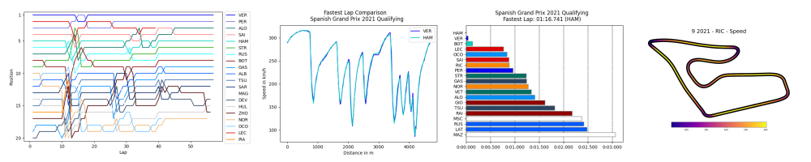

# Análisis de Telemetría F1 [](http://golang.org)
## Instalando FastF1 :checkered_flag:

FastF1 es una biblioteca de Python que proporciona herramientas y funcionalidades para acceder y analizar datos relacionados con la F1.




## Principales características :white_check_mark:

- Acceso a datos de tiempo, telemetría, resultados de sesiones de Fórmula 1 y más.
- Soporte completo para Ergast para acceder a datos actuales e históricos de la Fórmula 1.
- Todos los datos se proporcionan en forma de DataFrames extendidos de Pandas para facilitar el trabajo con los datos y tener herramientas poderosas disponibles.
- Agrega funciones personalizadas a los objetos de Pandas específicamente para agilizar y simplificar el trabajo con datos de Fórmula 1.
- Integración con Matplotlib para facilitar la visualización de datos.
- Implementa almacenamiento en caché para todas las solicitudes de API para acelerar la ejecución de tus scripts.

## Instalación :wrench:

Instalamos FastF1 utilizando `pip`
```commandline
pip install fastf1
```

Se requiere Python 3.8 o una versión superior.

Alternativamente, se puede descargar un archivo wheel o una distribución de código fuente desde Pypi.

También puedes instalarlo utilizando conda:
```commandline
conda install -c conda-forge fastf1
```

## Documentación :page_facing_up:

La documentación oficial la podrás encontrar aquí:
[docs.fastf1.dev](https://docs.fastf1.dev)
